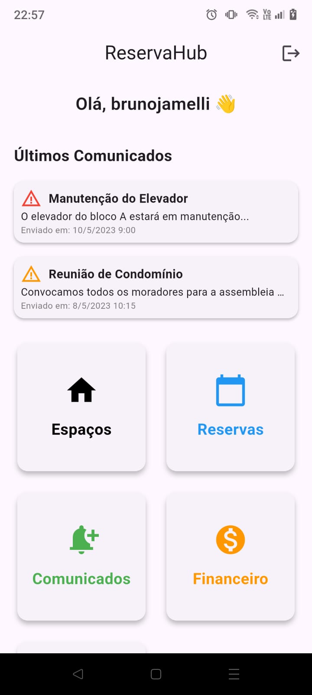
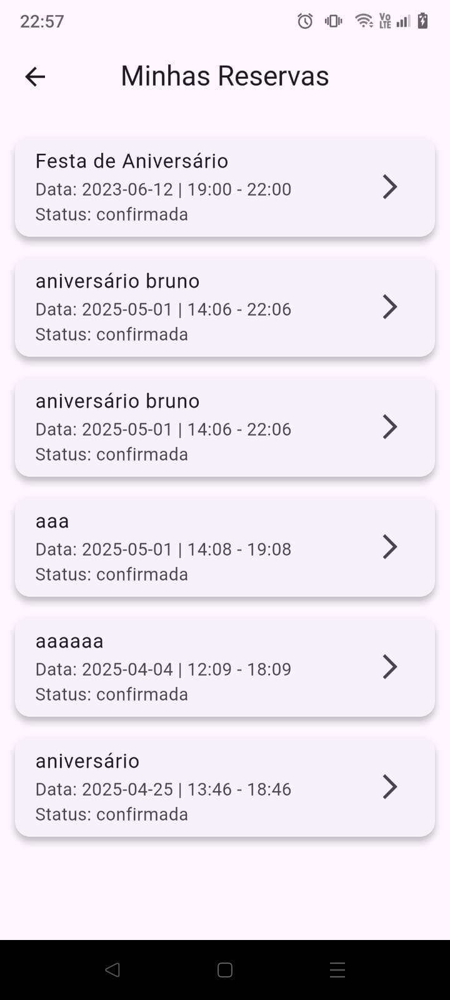
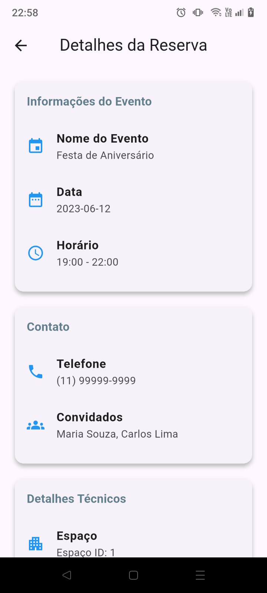
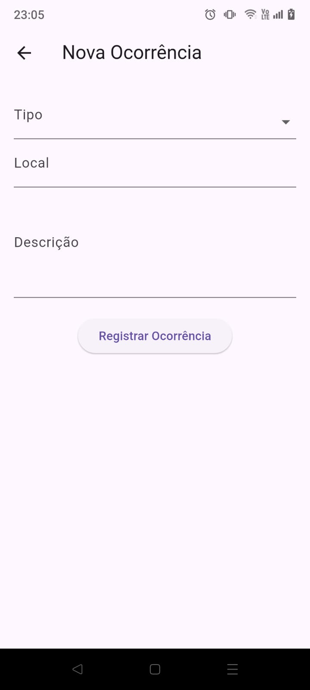
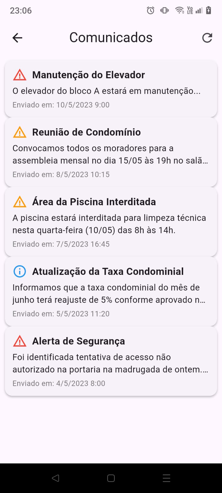
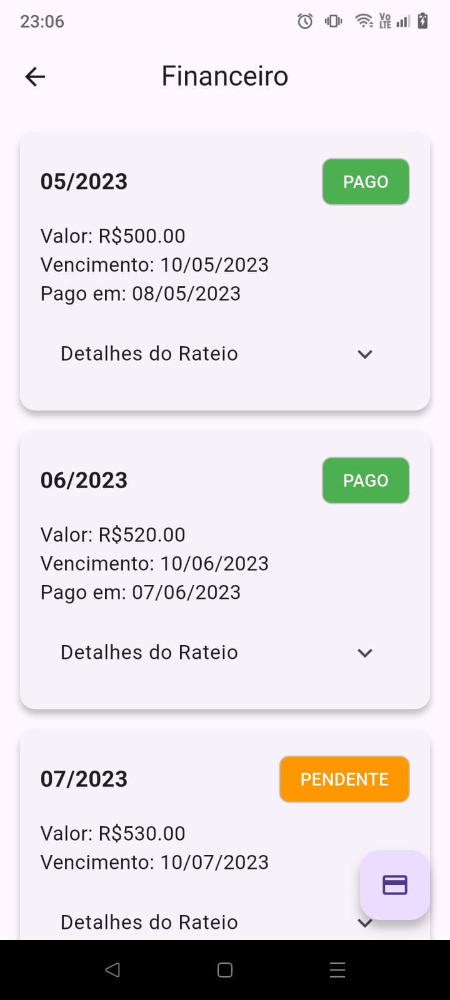
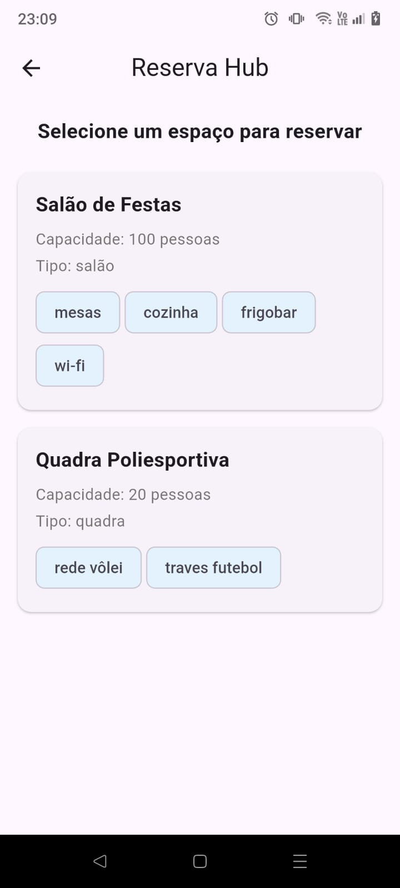
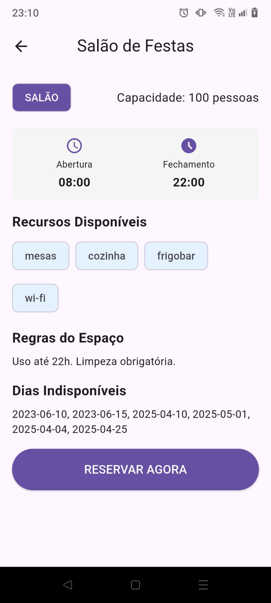
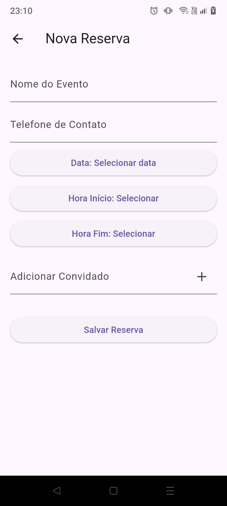

# reserva_hub

**Trabalho Final da Disciplina de Desenvolvimento Para Dispositivos Moveis**

## Getting Started

Uma plataforma que conecta moradores de condomínios com administradoras, permitindo reserva de áreas comuns, avisos e controle de despesas.

## Requisitos Funcionais
- Cadastro e Login
- Gestão de Áreas Comuns
- Central de Comunicados
- Envio de notificações
- Controle Financeiro
- Relatórios de Ocorrências
## Como executar o projeto ?
### caso não tenha instalado, instale o json-server
```bash
npm install -g json-server
```

### pegue o ip da sua maquina
windows
```bash
ip config
```

linux
```bash
if config
```

### Execute o json-server
```
json-server --watch reserva_hub_db.json --host ip_maquina --port 3000
```

### Baixe as dependencias
```bash
flutter pub get
```

### Execute o Projeto
```bash
flutter run
```
---

## 📸 Capturas de Tela

|  |  |  |
|:--:|:--:|:--:|
| **Tela Inicial** | **Minhas Reservas** | **Detalhes da Reserva** |

|  |  |  |
|:--:|:--:|:--:|
| **Nova Ocorrência** | **Comunicados** | **Financeiro** |

|  |  |  |
|:--:|:--:|:--:|
| **Espaços** | **Detalhes Espaço** | **Realizar Reserva** |


### Libs Utilizadas
- dio 
- flutter_launcher_icons
- flutter_native_splash
- intl
- shared_preferences

## Equipe
Bruno Jamelli e Cintia Nunes